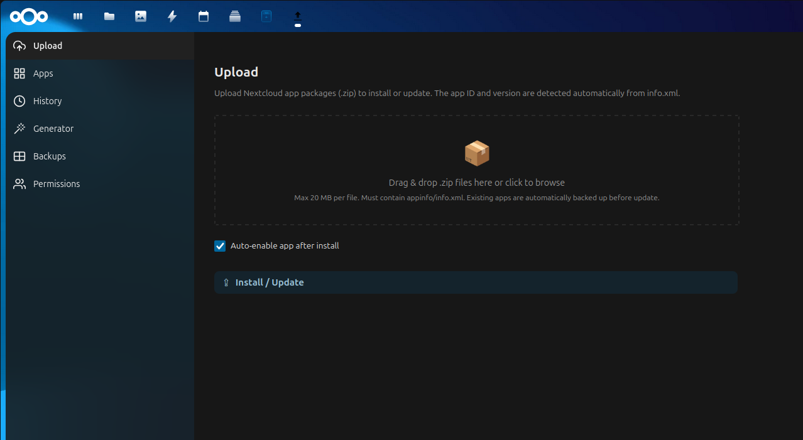

# AppDrop

[](https://github.com/cdnCore-Pt/AppDrop/actions/workflows/ci.yml)
[](https://www.gnu.org/licenses/agpl-3.0)
[](https://apps.nextcloud.com/apps/appdrop)
[](https://www.php.net/)

Upload, validate and install custom Nextcloud app packages (.zip) directly from the web UI — no SSH required.



## Features

- **Drag & drop upload** — Upload one or multiple custom .zip app packages with drag & drop or file picker
- **Pre-install validation** — Analyzes the zip before installing: structure checks, security validation, version compatibility, with actionable fix hints for every issue found
- **Automatic backups** — Existing apps are backed up before updates, with restore and delete options
- **App Manager** — List, enable, disable and remove installed custom apps
- **Template Generator** — Generate and download a ready-to-develop Nextcloud app skeleton
- **Upload History** — Log of all uploads with status and timestamps
- **Permission system** — Admins can grant upload access to specific users and groups
- **Dark & light theme** — Full support via Nextcloud CSS variables

## Requirements

- Nextcloud 30 – 32
- PHP 8.1+

## Installation

### From the Nextcloud App Store

Search for **AppDrop** in your Nextcloud app store and click **Install**.

### Manual

1. Download the latest release from [GitHub](https://github.com/cdnCore-Pt/AppDrop/releases)
2. Extract it into your Nextcloud `custom_apps/` directory
3. Enable it: **Administration Settings > Apps > AppDrop > Enable**

Or via command line:

```bash
php occ app:enable appdrop
```

## Usage

Once enabled, **AppDrop** appears in the top navigation bar.

### Uploading an app

1. Open AppDrop from the navigation bar
2. Drag a .zip file onto the upload zone (or click to browse)
3. A health check runs automatically, showing a detailed checklist
4. Click **Install / Update**
5. If the app already exists, a backup is created automatically before updating

### Sections

| Section | Who can access | What it does |
|---|---|---|
| **Upload** | Permitted users | Install or update custom apps from .zip packages |
| **Apps** | Admins | Enable, disable or remove installed custom apps |
| **History** | Permitted users | View past uploads with status |
| **Generator** | Permitted users | Download a Nextcloud app skeleton to start developing |
| **Backups** | Admins | Restore or delete backups from previous updates |
| **Permissions** | Admins | Grant or revoke upload access to users and groups |

### Settings

In **Administration Settings > AppDrop** you can configure:

- **Max upload size** (default: 20 MB)
- **Auto-enable apps** after installation

## License

AGPL-3.0-or-later

## Authors

- [Mehran Pourvahab](https://mehran.pt)
- [Henrique Rodrigues](https://github.com/HenriqueRamos13)
